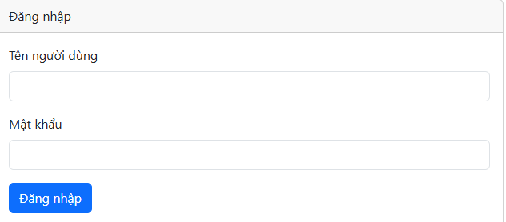

# 📂 SecureFileShare: Web Truyền File Dữ Liệu Có Ký Số

## ✨ Mô tả

**SecureFileShare** là một ứng dụng web cho phép người dùng truyền tải file dữ liệu một cách an toàn và xác thực thông qua việc sử dụng chữ ký số. Hệ thống cung cấp một nền tảng đơn giản, dễ sử dụng cho việc đăng ký tài khoản, tải lên file, ký số file bằng khóa riêng tư của người gửi, và gửi file đến người nhận khác. Người nhận có thể tải xuống file và xác minh tính toàn vẹn cũng như nguồn gốc của file thông qua chữ ký số đính kèm.

Dự án này tập trung vào việc áp dụng các nguyên lý bảo mật cơ bản trong truyền tải dữ liệu, đảm bảo rằng file không bị thay đổi trong quá trình gửi và người nhận có thể tin tưởng vào nguồn gốc của file.

## 🚀 Tính năng

* **Hệ thống Đăng ký & Đăng nhập Người dùng:**
    Người dùng có thể dễ dàng tạo tài khoản mới và đăng nhập để truy cập các tính năng của hệ thống.
    
    
    *Chụp màn hình trang Đăng nhập*

* **Quản lý File Cá nhân & Tải lên File:**
    Mỗi người dùng có một Dashboard cá nhân, nơi họ có thể tải lên các file mới. File sẽ được ký số tự động bằng khóa riêng tư của người gửi ngay khi tải lên.
    
    
    *Chụp màn hình Dashboard hiển thị phần tải lên file*

* **Gửi File Dữ liệu có Ký số:**
    Người dùng có thể chọn file đã tải lên của mình và gửi cho người dùng khác trong hệ thống. Hệ thống ghi lại thông tin giao dịch (người gửi, người nhận, file, thời gian).
    
    
    *Chụp màn hình modal "Gửi file" với danh sách người nhận*

* **Xem File đã Gửi và đã Nhận:**
    Người dùng có thể theo dõi các file mà họ đã gửi đi và các file mà họ đã nhận được từ người dùng khác.
    
    
    *Chụp màn hình danh sách các file đã gửi*

    
    *Chụp màn hình danh sách các file đã nhận*

* **Tải xuống & Xác minh Chữ ký số:**
    Khi người nhận tải xuống file, hệ thống sẽ tự động xác minh tính hợp lệ của chữ ký số bằng khóa công khai của người gửi. Kết quả xác minh được hiển thị rõ ràng.
    
    
    *Chụp màn hình cảnh báo/thông báo sau khi tải xuống và xác minh chữ ký*

## 💻 Công nghệ sử dụng

* **Backend:**
    * [**Python**](https://www.python.org/): Ngôn ngữ lập trình chính.
    * [**Flask**](https://flask.palletsprojects.com/): Framework web lightweight và linh hoạt.
    * [**Flask-SQLAlchemy**](https://flask-sqlalchemy.palletsprojects.com/): ORM để tương tác với cơ sở dữ liệu.
    * [**Flask-Login**](https://flask-login.readthedocs.io/): Quản lý phiên đăng nhập người dùng.
    * [**Werkzeug Security**](https://werkzeug.palletsprojects.com/): Để băm và kiểm tra mật khẩu.
    * [**python-dotenv**](https://pypi.org/project/python-dotenv/): Quản lý biến môi trường.
    * [**cryptography**](https://cryptography.io/en/latest/): Thư viện Python mạnh mẽ để thực hiện các thao tác mật mã (tạo cặp khóa RSA, ký số, xác minh chữ ký).
* **Frontend:**
    * **HTML5, CSS3, JavaScript:** Các ngôn ngữ cơ bản xây dựng giao diện.
    * [**Bootstrap 5**](https://getbootstrap.com/): Framework CSS để tạo giao diện responsive và đẹp mắt.
    * [**Google Fonts (Poppins)**](https://fonts.google.com/specimen/Poppins): Font chữ hiện đại.
* **Cơ sở dữ liệu:**
    * **SQLite:** Cơ sở dữ liệu mặc định (sử dụng file `site.db`), phù hợp cho phát triển và ứng dụng nhỏ. Có thể mở rộng lên PostgreSQL/MySQL cho production.

## 🛠️ Hướng dẫn cài đặt & chạy

Thực hiện các bước sau để cài đặt và chạy ứng dụng trên máy local của bạn.

### **Yêu cầu:**

* [Python 3.8+](https://www.python.org/downloads/)
* [Microsoft Visual C++ Build Tools](https://visualstudio.microsoft.com/downloads/#build-tools-for-visual-studio) (Chỉ Windows, cần cho `cryptography`): Trong quá trình cài đặt, chọn Workload **"Desktop development with C++"**.

### **Các bước:**

1.  **Clone hoặc tải xuống dự án:**
    ```bash
    git clone <URL_TO_YOUR_REPOSITORY> # Nếu bạn sử dụng Git
    # Hoặc tải file zip từ GitHub/nguồn khác
    ```

2.  **Di chuyển vào thư mục dự án:**
    ```bash
    cd SecureFileShare
    ```

3.  **Tạo và kích hoạt môi trường ảo:**
    Môi trường ảo giúp quản lý các thư viện Python độc lập cho dự án.
    ```bash
    python -m venv venv
    ```
    * **Trên Windows:**
        ```bash
        .\venv\Scripts\activate
        ```
    * **Trên macOS/Linux:**
        ```bash
        source venv/bin/activate
        ```
    (Bạn sẽ thấy `(venv)` xuất hiện ở đầu dòng lệnh sau khi kích hoạt.)

4.  **Cài đặt các thư viện cần thiết:**
    ```bash
    pip install -r requirements.txt
    ```

5.  **Tạo file `.env`:**
    Trong thư mục gốc của dự án, tạo một file mới tên `.env` và dán nội dung sau. **Thay đổi `SECRET_KEY` thành một chuỗi ngẫu nhiên và phức tạp của riêng bạn.**
    ```
    SECRET_KEY=your_super_secret_key_that_is_very_long_and_random_and_unique_for_production
    DATABASE_URL=sqlite:///site.db
    ```

6.  **Chuẩn bị Logo & Ảnh minh họa:**
    * Đặt file logo của bạn (ví dụ: `logo1.jpg` hoặc `my_logo.png`) vào thư mục `static/assets/`.
    * **Chụp các ảnh màn hình minh họa các chức năng** và đặt chúng vào thư mục `static/assets/`. Ví dụ: `login_page.png`, `dashboard_upload.png`, `send_file_modal.png`, `sent_files.png`, `received_files.png`, `download_verify.png`.
    * Đảm bảo đường dẫn trong thẻ `` của README.md và các file HTML là chính xác.

7.  **Chạy ứng dụng Flask:**
    ```bash
    python app.py
    ```
    Bạn sẽ thấy một thông báo cho biết ứng dụng đang chạy trên `http://127.0.0.1:5000/`.

8.  **Truy cập ứng dụng:**
    Mở trình duyệt web của bạn và truy cập: `http://127.0.0.1:5000/`

## 📸 Giao diện (Screenshot)

*(Phần này bạn có thể lặp lại ảnh tổng quan hoặc để trống nếu các ảnh trên đã đủ chi tiết)*


*Chụp màn hình tổng quan Dashboard (hoặc trang chính khác mà bạn muốn làm nổi bật)*

## 🧑‍💻 Tác giả

* **[Tên của bạn]**: [Liên kết đến GitHub/LinkedIn/Portfolio của bạn]
* *(Nếu có thành viên khác, liệt kê ở đây)*

## 📧 Liên hệ

Nếu có bất kỳ câu hỏi hoặc góp ý nào về dự án, vui lòng liên hệ:

* **Email:** your.email@example.com
* **GitHub:** [https://github.com/your-github-profile](https://github.com/your-github-profile)

## 📄 Bản quyền / Giấy phép (License)

Dự án này được cấp phép theo Giấy phép MIT. Vui lòng xem file [LICENSE](LICENSE) để biết thêm chi tiết.

*(Lưu ý: Nếu bạn chưa có file `LICENSE` trong dự án, bạn cần tạo nó. Bạn có thể tìm mẫu giấy phép MIT trực tuyến.)*
